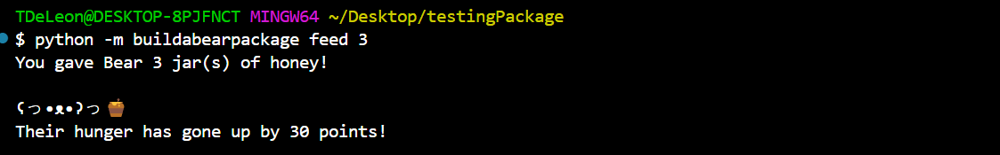

# Welcome to buildabear

Since the program is intended to be used on the command line, here is an exmaple of what the program should look like. 

## Command List

To get the list of command:

```
python -m buildabearpackage
```

This will output:


## Start

To start the game and create your bear:

```
python -m buildabearpackage start
```

This will create a bear desktop pet for you. Their default name will be Bear. 


However, if you have already created a bear, the command will tell you and will not allow you to craete another.


## Change Name

If you would like to change the name of your bear type:

```
python -m buildabearpackage "change name"
```

You will be prompted to enter the name of your bear and your bear will always be referred to by that time.


## Check Status

It is up to you to take care of your bear. If you want to check the status of the bear to see what it needs you can type:

```
python -m buildabearpackage status
```

If you are tried to status before making your pet you will get:


Once you have created your bear, the status command will output the current status of your bear. This includes: their happiness, cleanliness, hunger, and your budget. Your bear will start off with full stats, but if too much time passes by without taking care of your bear:


If you are taking wonderful care of your bear you will get:


But How do you take care of your bear?

## Work and Buy

We would like to feed our bear, however to feed it we are going to need food. To buy food we are going to need money. You may use the command work followed by the number of hours you want to work. Then you may buy food using "buy food" followed by the number of food items you would like to purchase. As an example:

```
python -m buildabearpackage "work" 4 
python -m buildabearpackage "buy food" 4 
```

This will show you how much you have earned. When you buy, it will confirm your purchase and how much you spent. 


Now that we have food, let's feed our bear!

## Feed your bear

Your bears stats will go down by the second so it is important to feed your bear. In the command line type the feed command followed by how much food you would like to feed your bear:

```
python -m buildabearpackage feed 3
```

And you will get:



Now their hunger stat will go up by 10 times the amount of food you feed them. Now they are less hungry! 

## Clean your bear

Your bear needs to stay squeaky clean. To clean your bear:

```
python -m buildabearpackage clean
```

This will output:


Their cleanliness will go up by 30 points. 

## Play with your bear

To make thier happiness go up, you can play with your bear. Type:

```
python -m buildabearpackage play
```

This will generate a random playful event with your bear:


Their happiness will go up by 20 points no matter the event.

## Conclude

And that is how all you need to know to use buildabearpackage: your command line desktop bear!


